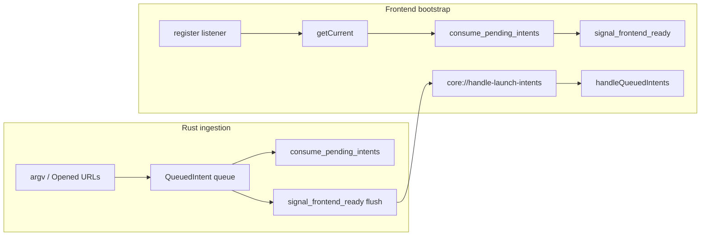

# CLI Arguments and Deep Links

Vesta Launcher supports command-line arguments and deep link protocols for external integration, allowing other applications and websites to interact with the launcher. This enables features like "Open in Vesta" buttons on mod hosting sites and desktop shortcuts.

## Overview

The system provides three main integration methods:
- **CLI Arguments**: Direct command-line invocation with arguments
- **Deep Links**: URL-based protocol handling (`vesta://` URLs)
- **File Associations**: OS-level `.mrpack` file handling (double-click / Open With)
- **Single Instance**: Ensures only one launcher instance runs, forwarding arguments to existing instance

## File Associations

Vesta registers `.mrpack` (Modrinth modpack) files in `tauri.conf.json` via `bundle.fileAssociations`. After a production build/install, the OS can open `.mrpack` files with Vesta.

**Behavior:**
- **Windows/Linux**: File path arrives via `std::env::args()` on cold start, or via the single-instance plugin when already running
- **macOS**: File path arrives via `RunEvent::Opened` and is queued until the frontend signals ready
- **Frontend**: Opens the `/install` page with `modpackPath` and `isModpack: true`

## Single Instance Handling

Vesta uses Tauri's single instance plugin to ensure only one launcher window is open at a time:

```rust
.plugin(tauri_plugin_single_instance::init(|app, args, _cwd| {
    let _ = crate::utils::windows::ensure_main_window_visible(&app);

    if args.len() > 1 {
        crate::utils::launch_intents::ingest_launch_args(&args);
        if app.state::<PendingLaunchIntents>().is_frontend_ready() {
            crate::utils::launch_intents::flush_pending_intents(&app);
        }
    }
}))
```

**Behavior:**
- If launcher is not running: Launches normally; intents are queued until the frontend calls `signal_frontend_ready`
- If launcher is running: Focuses existing window and forwards intents immediately when ready
- Intents are delivered as structured batches on `core://handle-launch-intents` (`argv` preserves CLI flags; `path` is a single opened file)

## Cold Start Handshake

On cold start, launch intents (CLI args, deep links, opened files) are queued in Rust until the frontend is ready:

1. Frontend registers `core://handle-launch-intents` listener
2. Frontend calls `getCurrent()` (deep-link plugin) and `consume_pending_intents()`
3. Frontend calls `signal_frontend_ready` to flush any remaining queued intents



**Intent shapes:**
- `{ type: "argv", args: ["--open-resource", "modrinth", "fabric-api"] }` — full CLI tail, flags preserved
- `{ type: "path", path: "/path/to/pack.mrpack" }` — single opened file (macOS Open With, or lone path argv)

## CLI Arguments

### Supported Arguments

#### `--launch-instance <slug>`
Directly launches a Minecraft instance without opening the UI.

```bash
vesta-launcher.exe --launch-instance "vanilla-1-20-1"
```

**Processing:**
```typescript
if (arg === "--launch-instance" && args[i + 1]) {
    const slug = args[i + 1];
    const inst = instancesState.instances.find(inst => 
        inst.slug === slug || inst.name.toLowerCase().replace(/ /g, "-") === slug
    );
    if (inst) {
        setLaunching(slug, true);
        await invoke("launch_instance", { instanceData: inst });
    }
}
```

#### `--open-instance <slug>`
Opens the instance details page in the launcher.

```bash
vesta-launcher.exe --open-instance "vanilla-1-20-1"
```

**Processing:**
```typescript
if (arg === "--open-instance" && args[i + 1]) {
    const slug = args[i + 1];
    router()?.navigate("/instance", { slug });
    setPageViewerOpen(true);
}
```

#### `--open-resource <platform> <project-id>`
Opens the resource details page for a specific mod/resource.

```bash
vesta-launcher.exe --open-resource modrinth "fabric-api"
```

**Processing:**
```typescript
if (arg === "--open-resource" && args[i + 2]) {
    const platform = args[i + 1];
    const id = args[i + 2];
    router()?.navigate("/resource-details", { platform, projectId: id });
    setPageViewerOpen(true);
}
```

### Instance Slug Resolution

CLI arguments accept instance slugs in multiple formats:
- **Exact slug**: `vanilla-1-20-1`
- **Name-based**: `Vanilla 1.20.1` → `vanilla-1-20-1` (lowercase, spaces to hyphens)

```typescript
const inst = instancesState.instances.find(inst => 
    inst.slug === slug || inst.name.toLowerCase().replace(/ /g, "-") === slug
);
```

## Deep Link Protocol

### URL Format

Vesta supports `vesta://` protocol URLs for cross-application integration:

```
vesta://<action>?<parameters>
vesta://<action>/<path-segment>?<parameters>
```

### Canonical URL Reference

| Action | Example |
|--------|---------|
| Install modpack/resource | `vesta://install?projectId=abc&platform=modrinth` |
| Open resource page | `vesta://open-resource/modrinth/fabric-api` |
| Open instance page | `vesta://open-instance?slug=my-slug` |
| Launch instance | `vesta://launch-instance?slug=my-slug` or `vesta://launch-instance/my-slug` |
| Legacy copy links | `vesta:///instance?path=%2Finstance&slug=my-slug` (still supported) |

### Supported Actions

#### `install`
Opens the installation page with pre-filled parameters.

**Examples:**
```
vesta://install?version=1.20.1&modloader=fabric
vesta://install?projectId=fabric-api&platform=modrinth
```

**Processing:**
```rust
"install" => {
    Ok(DeepLinkMetadata {
        target: DeepLinkTarget::Install,
        params,
    })
}
```

#### `standalone`
Legacy action for resource handling, redirects based on type.

**Examples:**
```
vesta://standalone?type=modpack&projectId=skyfactory&platform=curseforge
vesta://standalone?type=mod&projectId=fabric-api&platform=modrinth
```

#### `open-resource`
Opens resource details page with platform and project ID.

**Examples:**
```
vesta://open-resource/modrinth/fabric-api
vesta://open-resource/curseforge/jei
```

#### `open-instance`
Opens the instance details page for a slug.

**Examples:**
```
vesta://open-instance?slug=vanilla-1-20-1
```

#### `launch-instance`
Launches an instance directly without opening its page.

**Examples:**
```
vesta://launch-instance/vanilla-1-20-1
vesta://launch-instance?slug=vanilla-1-20-1
```

**Processing:**
```rust
"open-resource" => {
    if segments.len() >= 2 {
        params.insert("platform".to_string(), segments[0].to_string());
        params.insert("projectId".to_string(), segments[1].to_string());
    }
    Ok(DeepLinkMetadata {
        target: DeepLinkTarget::ResourceDetails,
        params,
    })
}
```

### URL Parsing

Deep links are parsed using Rust's `url` crate:

```rust
#[tauri::command]
pub fn parse_vesta_url(url: String) -> Result<DeepLinkMetadata, String> {
    use url::Url;
    let parsed_url = Url::parse(&url)?;
    
    if parsed_url.scheme() != "vesta" {
        return Err("Invalid protocol".to_string());
    }
    
    let action = parsed_url.host_str().unwrap_or("");
    // Extract query parameters and path segments...
}
```

### Frontend Handling

Deep links are processed through the `handleDeepLink` function:

```typescript
async function handleDeepLink(url: string, navigate: ReturnType<typeof useNavigate>) {
    // 1. Check app initialization
    // 2. Check authentication
    // 3. Parse URL via backend
    const metadata = await invoke("parse_vesta_url", { url });
    
    // 4. Map to router paths
    let path = "";
    switch (metadata.target) {
        case "install": path = "/install"; break;
        case "resource-details": path = "/resource-details"; break;
    }
    
    // 5. Navigate to page
    router()?.navigate(path, metadata.params);
    setPageViewerOpen(true);
}
```

## Integration Examples

### Website Integration

Mod hosting sites can add "Open in Vesta" buttons:

```html
<!-- Mod page -->
<a href="vesta://open-resource/modrinth/fabric-api">
    
</a>

<!-- Modpack page -->
<a href="vesta://install?projectId=skyfactory&platform=curseforge&type=modpack">
    Install with Vesta
</a>
```

### Desktop Shortcuts

Shortcuts created from pinned items use CLI arguments:

```typescript
const handleCreateShortcut = async (quickLaunch = false) => {
    let args = "";
    if (pin.page_type === "instance") {
        args = quickLaunch 
            ? `--launch-instance ${pin.target_id}` 
            : `--open-instance ${pin.target_id}`;
    } else {
        args = `--open-resource ${pin.platform} ${pin.target_id}`;
    }
    
    await invoke("create_desktop_shortcut", {
        name: pin.label,
        targetArgs: args,
        iconPath: pin.icon_url,
    });
};
```

### macOS Integration

On macOS, CLI arguments are converted to deep links for .inetloc files:

```rust
let deep_link = if target_args.starts_with("--") {
    let parts: Vec<&str> = target_args.split_whitespace().collect();
    if parts.len() >= 2 {
        let action = parts[0].trim_start_matches("--");
        format!("vesta://{}/{}", action, parts[1])
    } else {
        format!("vesta://{}", parts[0].trim_start_matches("--"))
    }
} else {
    target_args.clone()
};
```

## Security Considerations

### Input Validation

- **Protocol Check**: Only `vesta://` URLs are accepted
- **Authentication Required**: Deep links require authenticated accounts (not guest mode)
- **App Initialization**: Links are rejected until setup is complete

```typescript
// Authentication check
const account = await getActiveAccount();
if (!account || account.account_type === ACCOUNT_TYPE_GUEST || account.is_expired) {
    showToast({
        title: "Authentication Required",
        description: "Please sign in to a valid account to use 'Open in Vesta'.",
        severity: "error",
    });
    return;
}
```

### Parameter Sanitization

- **URL Parsing**: Uses Rust's `url` crate for safe parsing
- **Path Segments**: Validates and extracts path components
- **Query Parameters**: Sanitizes query parameter values

### Error Handling

- **Invalid URLs**: Clear error messages for malformed links
- **Unknown Actions**: Graceful fallback for unsupported actions
- **Missing Resources**: User-friendly messages for non-existent instances/resources

## Platform-Specific Behavior

### Windows
- **Protocol Registration**: `vesta://` URLs automatically open the launcher
- **Single Instance**: Arguments forwarded to existing instance
- **Focus Management**: Existing window is focused when new instance would open

### macOS
- **Deep Link Plugin**: Uses Tauri's deep link plugin for URL handling
- **Internet Location Files**: Desktop shortcuts use .inetloc format
- **App Focus**: Existing app instance is brought to foreground

### Linux
- **Desktop Integration**: Respects freedesktop.org standards
- **URL Handlers**: Registers as handler for `vesta://` protocol
- **Window Management**: Focuses existing window via window manager

## Future Enhancements

### Planned Features
- **Custom Actions**: Extensible action system for plugins
- **Parameter Validation**: Schema-based validation for link parameters
- **Link Previews**: Rich previews when hovering over vesta:// links
- **Bulk Operations**: Support for multiple resources in single link
- **Authentication Flow**: OAuth integration for external applications

### Technical Improvements
- **Link Shortening**: Short URL support for complex parameter sets
- **Link Analytics**: Usage tracking for integration optimization
- **Fallback Handling**: Graceful degradation when launcher isn't installed
- **Cross-Platform Testing**: Automated testing of deep link functionality